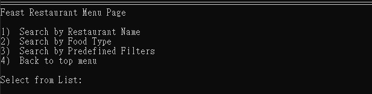

## Feast System
Feast app provides restaurant’s information nearby CMU, allowing user to compare price and rating from multiple platforms. There are three main functions in the app, one is restaurant information system. The other is the calorie calculator. Last is a function that allows user to update the data source.

## 1. Environments check and Packages
Windows10
Python 3.7 above
Manually download the packages list as follow, or use the requirement.txt to download them at once

Package name [version]:

urllib3 [1.26.4]
Beautifulsoup4 [4.11.1]
pandas [1.2.4]
selenium [4.5.0]
webdriver_manager [3.8.3]
requests [2.25.1]
numpy [1.19.5]
openpyxl [3.0.3]

###### API KEY for googel.api had already hard code in the update files
### 2. installation process
1. Install Python3.7 or above
2. Install all necessary packages list above or install them using requirement.txt
3. Run the “Feast/group_4_Feast_app.py”
### Instructions
⚫ main menu
1. After install all the necessary package, click on “group_4_Feast_app.py” to start the app
2. At main menu you could choose 3 function or enter 4 to exit

⚫ Restaurants Selection
1. After choosing Restaurants selection, you would see the menu page for Restaurants selection

2. Choose a way to filter the restaurant information
* Search by Restaurant Name: allow user to enter a name of a restaurant and return all matches

* Search by Food Type: allow user to enter food type such as Chinese and return all matches

* Search by Predefined Filters: allow user to search with advance filter

All three searches would ask user to type in the number of rows they like to display
3. After viewing the information on the search results(ex. comparing avg.Rating, avg.price on uber)

User could Enter Restaurant ID (number at far left) to compare Uber Eats and DoorDash Menu Pricing.
OR Enter 'r' to return to Restaurant Menu:
⚫ Calorie Calculator Calorie Calculator is based on python bulit in GUI tkinter.
1. After choosing Calorie Calculator, a GUI interface for main menu of the calculator would pop up.

2. Click on View Personal info to view and download past personal body information

3. Click on Manage Personal info to enter new personal body information

4. Click on View Diet record to view and download past diet record

5. Click on Manage Record to enter new diet information

6. After entering the personal information and Diet for Today, It would show how much calorie you are recommend to take.

### Tree structure and description

